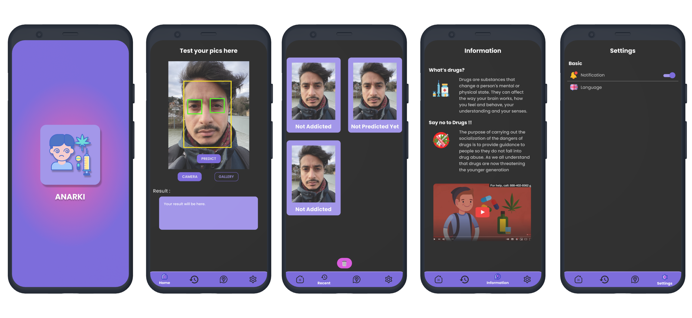

# Capstone-Project-B21-CAP0463
The repository of Capstone Project Bangkit 2021 by Team B21-CAP0463 (SatuJalan Team)

### Anarki: First layer detection of drug abuse by face recognition based on mobile apps

Team Member:
* Annas Furqon Mahdali (A0080787) - Mobile Programming (Android) - Universitas Gadjah Mada
* Muhammad Luthfirrohman (A2962681) - Mobile Programming (Android) - UPN Veteran Jawa Timur
* Nur Habib Rizki Saputro (M3122771) - Machine Learning - Universitas Sebelas Maret
* Jidan Amaripujo (M0080785) - Machine Learning - Universitas Gadjah Mada
* Tito Septa Nanpertama (C3072747) - Cloud Computing - Universitas Raharja
* Muhammad Fadhilah Sukmojatmiko (C0080777) - Cloud Computing - Universitas Gadjah Mada

How to use Apps :
1. Open Settings -> Give permission(Allow) for Install Unknown Apps/Source
2. Download the APK Files [here](https://drive.google.com/file/d/1KqHYvWPSAvaPEXCLqvJN6YOLjk5ETSFc/view?usp=sharing)
3. Install APK FIles (Allow install for spesific apps(if required))
4. Open App
5. Choose method to get Image (Camera or Gallery)
6. Press button Predict (wait a second to get Prediction Result)
7. Explore another page (History to know how many Image Predicted, Information to knwo more about the Danger of Drugs, Setting to get notified everyday and change the language)
