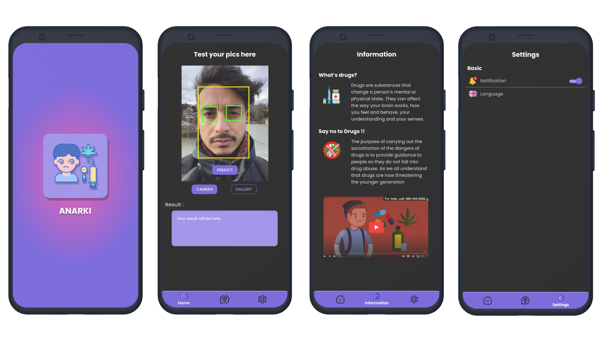
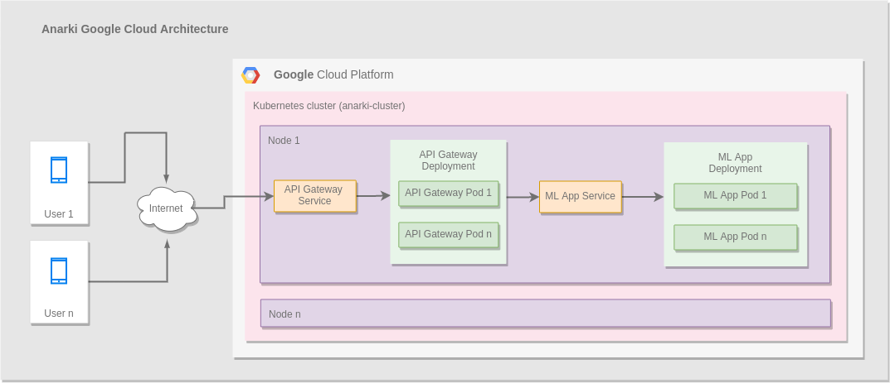

# Capstone-Project-B21-CAP0463
The repository of Capstone Project Bangkit 2021 by Team B21-CAP0463 (SatuJalan Team)

### Anarki: First layer detection of drug abuse by face recognition based on mobile apps

Team Member:
* Annas Furqon Mahdali (A0080787) - Mobile Programming (Android) - Universitas Gadjah Mada
* Muhammad Luthfirrohman (A2962681) - Mobile Programming (Android) - UPN Veteran Jawa Timur
* Nur Habib Rizki Saputro (M3122771) - Machine Learning - Universitas Sebelas Maret
* Jidan Amaripujo (M0080785) - Machine Learning - Universitas Gadjah Mada
* Tito Septa Nanpertama (C3072747) - Cloud Computing - Universitas Raharja
* Muhammad Fadhilah Sukmojatmiko (C0080777) - Cloud Computing - Universitas Gadjah Mada
